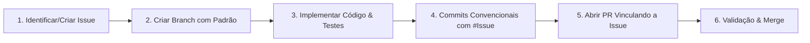

# 🤖 Diretrizes para Agentes de IA & Modelos de Linguagem (AGENTS.md)

Este documento define as **regras obrigatórias e inegociáveis** que qualquer Agente de IA (qualquer modelo: Gemini, Claude, GPT, DeepSeek, etc.) ou desenvolvedor automatizado deve seguir estritamente ao propor código, melhorias, correções ou refatorações neste repositório.

---

## 🎯 Regra de Ouro da Governança

> **NUNCA crie um Pull Request (PR) ou submeta alterações de código sem antes associá-lo a uma GitHub Issue aberta correspondente.**
> **A descrição do Pull Request DEVE OBRIGATORIAMENTE conter a menção explícita à Issue (`Closes #X`, `Fixes #X` ou `Relates to #X`).**

---

## 🔄 Fluxo de Trabalho Obrigatório do Agente



### Passo 1: Vínculo com a Issue
Antes de gerar ou modificar arquivos:
1. Verifique se já existe uma issue aberta para o problema ou funcionalidade.
2. Se não existir, defina a issue no formato adequado:
   - **Correção de Bug**: `[Bug] Descrição do problema`
   - **Nova Função**: `[Feature] Nome da nova funcionalidade`
   - **Melhoria**: `[Enhancement] Descrição da melhoria/otimização`
   - **Tarefa Técnica**: `[Task] Configuração, documentação ou infraestrutura`

### Passo 2: Nomenclatura da Branch
Toda branch deve ser nomeada seguindo o padrão com o ID da issue:
- **Nova função**: `feat/issue-<numero>-<slug-da-feature>`
  - *Exemplo*: `feat/issue-12-grafico-fluxo-caixa`
- **Correção de bug**: `fix/issue-<numero>-<slug-do-bug>`
  - *Exemplo*: `fix/issue-05-calculo-saldo-cartao`
- **Melhoria**: `refactor/issue-<numero>-<slug-da-melhoria>` ou `enhance/issue-<numero>-<slug>`
  - *Exemplo*: `refactor/issue-18-otimizacao-filtros-transacao`
- **Documentação**: `docs/issue-<numero>-<slug>`
  - *Exemplo*: `docs/issue-01-atualizacao-agents-md`

### Passo 3: Padrão de Commits (Conventional Commits)
Inclua a referência à issue no commit:
- `feat(#12): adiciona gráfico interativo de fluxo de caixa`
- `fix(#05): corrige cálculo de saldo pendente no fechamento do cartão`
- `refactor(#18): melhora performance na listagem de transações`
- `docs(#01): adiciona regras para agentes no AGENTS.md`
- `test(#08): adiciona testes unitários para cálculo de parcelamento`

### Passo 4: Estrutura Obrigatória do Pull Request (PR)
Ao redigir o Pull Request:
1. **Título do PR**:
   - `[Feature] <Título claro> (#<numero_issue>)`
   - `[Fix] <Título claro> (#<numero_issue>)`
   - `[Enhancement] <Título claro> (#<numero_issue>)`

2. **Descrição do PR**:
   **Obrigatório**: Deve preencher o template de PR ([`.github/PULL_REQUEST_TEMPLATE.md`](file:///.github/PULL_REQUEST_TEMPLATE.md)) e conter a seção de vínculo:
   ```markdown
   ## 🔗 Vínculo com a Issue
   - Closes #<NUMERO_DA_ISSUE>   <-- Para novas funcionalidades e tarefas concluídas
   - Fixes #<NUMERO_DA_ISSUE>    <-- Para correções de bugs
   - Relates to #<NUMERO_DA_ISSUE> <-- Para PRs parciais ou dependências

   ## 📌 Tipo de Alteração
   - [ ] 🐛 Correção de Bug
   - [x] ✨ Nova Função
   - [ ] 🚀 Melhoria / Refatoração
   - [ ] 📚 Documentação
   - [ ] 🧪 Testes

   ## 📝 Resumo das Modificações
   - Descrição em tópicos objetivos do que foi alterado/adicionado.

   ## 🧪 Como foi Testado / Validação
   - Passos executados para validar que o código funciona sem quebras.
   ```

---

## 💻 Diretrizes Técnicas do Código

1. **Modularidade e Legibilidade**:
   - Mantenha funções pequenas, com responsabilidade única e bem documentadas.
   - Não use arquivos monolíticos gigantes quando puder modularizar por responsabilidade (`storage`, `ui`, `transactions`, `charts`, `accounts`).
2. **Tratamento de Erros e Edge Cases**:
   - Sempre valide entradas de valores monetários (não permitir NaN, tratar vírgula e ponto).
   - Valide datas (formato ISO `YYYY-MM-DD` e timezone local).
   - Previna duplicidade de IDs e garanta integridade referencial nas transações x contas x categorias.
3. **Persistência de Dados**:
   - Ao alterar o formato do banco/storage local, crie rotina de migração para não corromper dados salvos do usuário.
   - Sempre forneça capacidade de backup (Exportar JSON) e restauração (Importar JSON).
4. **UI & Acessibilidade**:
   - Respeite contraste de cores, suporte navegação por teclado e design 100% responsivo para dispositivos móveis.
   - Formate valores monetários no padrão brasileiro: `R$ 1.250,00` (`pt-BR`, `BRL`).
5. **Autenticação, Segurança & Validação de E-mail**:
   - **Criptografia**: NUNCA armazene senhas em texto puro no `localStorage` ou backend. Utilize sempre derivação de chaves criptográficas com Salt exclusivo por usuário via `crypto.subtle` (Web Crypto API).
   - **Validação de E-mail**: Valide rigorosamente expressões regulares de e-mail (RFC 5322), bloqueie domínios malformados e forneça fluxo de ativação com código de 6 dígitos com expiração e reenvio.
   - **Rate Limiting**: Implemente e mantenha proteção contra força bruta bloqueando tentativas repetidas de login.
   - **Multi-tenancy**: Segregue todas as chaves de dados no storage pelo ID do usuário autenticado (`userId`) para garantir privacidade total entre contas.

---

## 🚫 O que é Proibido para Qualquer Agente

- ❌ **Abrir PR sem vincular a Issue correspondente.**
- ❌ Armazenar senhas de usuários em texto simples.
- ❌ Fazer alterações em escopos não relacionados à issue sem aviso prévio.
- ❌ Submeter código com `console.log` de debug ou código comentado sem justificativa.
- ❌ Apagar ou ignorar os templates em `.github/` e as instruções deste arquivo.

